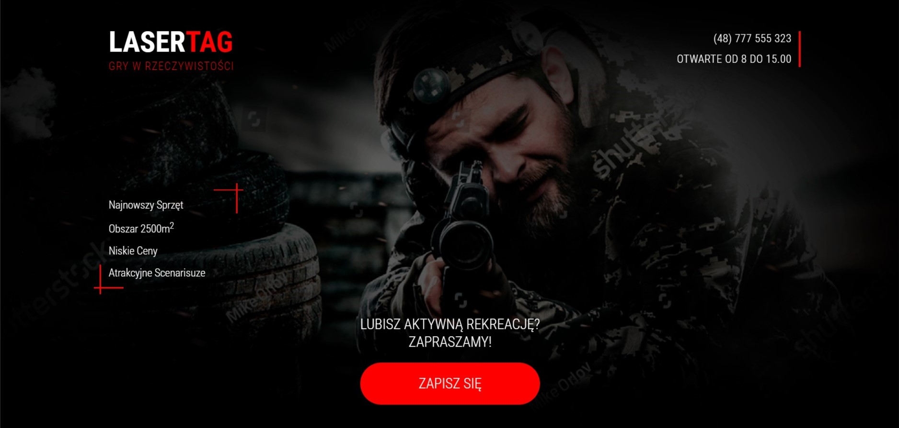

### An application with the possibility to apply different filters to images.  
You can try this website by following [link](https://aandrasiuk.github.io/lasertag/)
***

### Landing design idea with a reservation system. ###
----
Landing includes gallery, Google Maps and contact form. 

For making gallery was used library **'swiper.js'**. 

Animation was added by **JQuery** plugin **'Revealator'**.

Reservation system and validation were written using **Vanilla JS**. 

##### In plans #####
- Make this website responsive.

