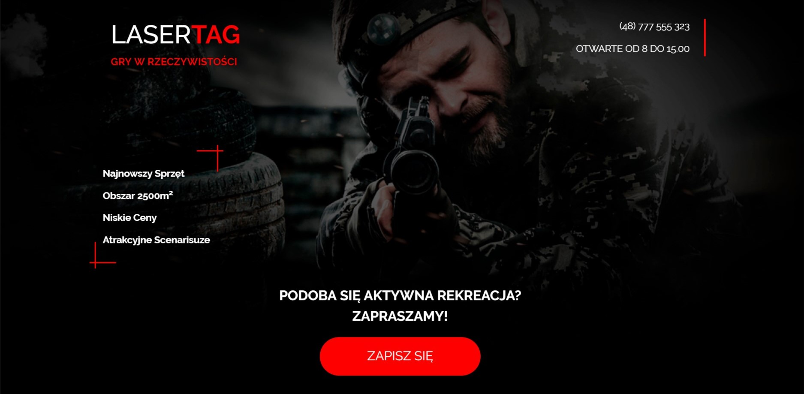

### Landing design idea with a reservation system. ###

You can try this website by following [link](https://aandrasiuk.github.io/lasertag/)

----
Landing includes gallery, Google Maps and contact form. 

For making gallery was used library **'swiper.js'**. 

Animation was added by **JQuery** plugin **'Revealator'**.

Responsiveness was achieved thanks to such technologies as CSS **Grid** and **Bootstrap**.
 
Reservation system and validation were written using **Vanilla JS**. 

##### In plans #####
- Make reservation system responsive.

